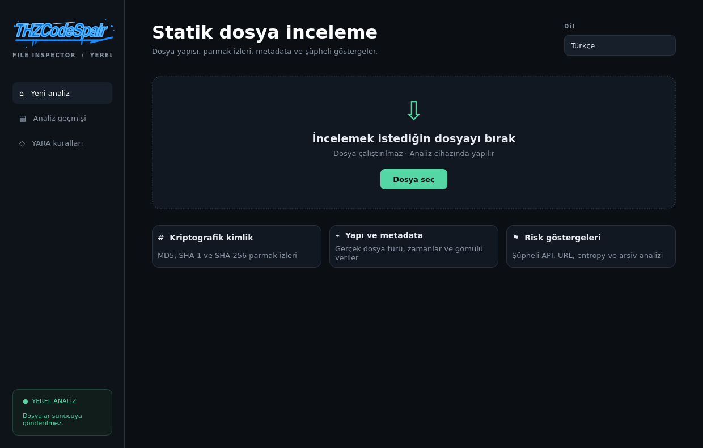

# THZCodeSpair File Inspector


Yerel çalışan, şüpheli dosyaları **çalıştırmadan** inceleyen masaüstü statik analiz uygulaması ve CLI aracı.

A local-first desktop application and CLI for inspecting suspicious files **without executing or uploading them**.



## Neden bu proje? · Why this project?

Bir antivirüs sonucunun ötesinde, risk puanının *neden* oluştuğunu gösterir. Dosya parmak izlerini, gerçek formatı, metadata'yı, entropy'yi, gömülü ağ göstergelerini, PE/ELF güvenlik özelliklerini, arşiv yapısını ve YARA eşleşmelerini tek bir açıklanabilir raporda toplar.

It goes beyond a binary antivirus verdict by showing *why* a score was assigned. Fingerprints, true file format, metadata, entropy, network indicators, PE/ELF properties, archive structure and YARA matches are combined into one explainable report.

## Özellikler · Features

- Tamamen yerel analiz; otomatik bulut yüklemesi yok
- MD5, SHA-1 ve SHA-256 parmak izleri
- libmagic ile içerik tabanlı dosya türü tespiti
- PE import/API, imza tablosu, bölüm entropy'si ve overlay incelemesi
- ELF executable-stack ve RELRO kontrolleri
- PDF JavaScript, OpenAction, Launch ve EmbeddedFile göstergeleri
- Office VBA makrosu, şifreli arşiv ve ZIP path-traversal tespiti
- URL, IP, e-posta ve okunabilir string çıkarımı
- Dahili YARA kuralları: process injection, credential access, ransomware, script obfuscation ve Android abuse
- Kuruluysa otomatik ClamAV imza taraması
- Açıklanabilir 0–100 risk skoru
- Yerel SQLite analiz geçmişi
- Bağımsız HTML ve makine-okunur JSON raporları
- Türkçe ve İngilizce masaüstü arayüz
- CI kullanımına uygun `--fail-on` çıkış kodları

## Hızlı başlangıç · Quick start

```bash
git clone https://github.com/THZCodeSpair/thzcodespair-file-inspector.git
cd thzcodespair-file-inspector
python3 -m venv .venv
source .venv/bin/activate
pip install -e .
python main.py
```

Linux üzerinde sistem paketleri:

```bash
sudo apt install libmagic1 exiftool binutils
# İsteğe bağlı gerçek antivirüs imza taraması:
sudo apt install clamav && sudo freshclam
```

## CLI

```bash
# Terminal özeti
thz-inspect suspicious.exe

# HTML ve JSON raporu
thz-inspect suspicious.exe --html report.html --json report.json

# CI içinde yüksek riskte exit code 2
thz-inspect artifact.bin --quiet --fail-on high
```

Exit kodları: `0` başarılı, `1` analiz hatası, `2` seçilen risk eşiği aşıldı.

## Risk skoru

Skor, tek bir imzaya dayanmaz. Yapısal bulgular ve davranış göstergeleri ağırlıklı olarak birleştirilir:

| Aralık | Sonuç | Yorum |
|---:|---|---|
| 0–14 | Düşük risk | Belirgin statik gösterge bulunmadı |
| 15–39 | Dikkat | Manuel inceleme gerektiren göstergeler var |
| 40–69 | Şüpheli | Birden fazla güçlü gösterge bulundu |
| 70–100 | Yüksek risk | İmza veya güçlü davranış zinciri mevcut |

> Düşük risk sonucu güvenlik garantisi değildir. Statik analiz; çalışma zamanında indirilen, şifrelenmiş veya ortam koşuluna bağlı davranışları göremeyebilir.

## Güvenlik modeli

- Hedef dosya import edilmez, yüklenmez veya çalıştırılmaz.
- Dosya argümanları shell üzerinden geçirilmez.
- Harici çözümleyiciler zaman aşımıyla ve argüman listesiyle çağrılır.
- Arşivler diske çıkarılmadan listelenir.
- HTML raporunda dosya kaynaklı tüm metinler escape edilir.
- VirusTotal veya başka bir bulut servisine otomatik gönderim yapılmaz.

Ayrıntılar: [SECURITY.md](SECURITY.md) ve [mimari belge](docs/ARCHITECTURE.md).

## Geliştirme

```bash
pip install -e ".[dev]"
pytest
python -m py_compile analyzer.py cli.py history_store.py main.py reporting.py
```

Linux paketi üretmek için:

```bash
./scripts/build_linux.sh
```

## Proje durumu

Proje aktif geliştirme aşamasındadır. Yol haritasında APK manifest ayrıştırma, Authenticode sertifika zinciri doğrulama, kullanıcı YARA kural dizinleri ve izole dinamik analiz entegrasyonu bulunuyor.

## Lisans

[MIT](LICENSE) © THZCodeSpair
