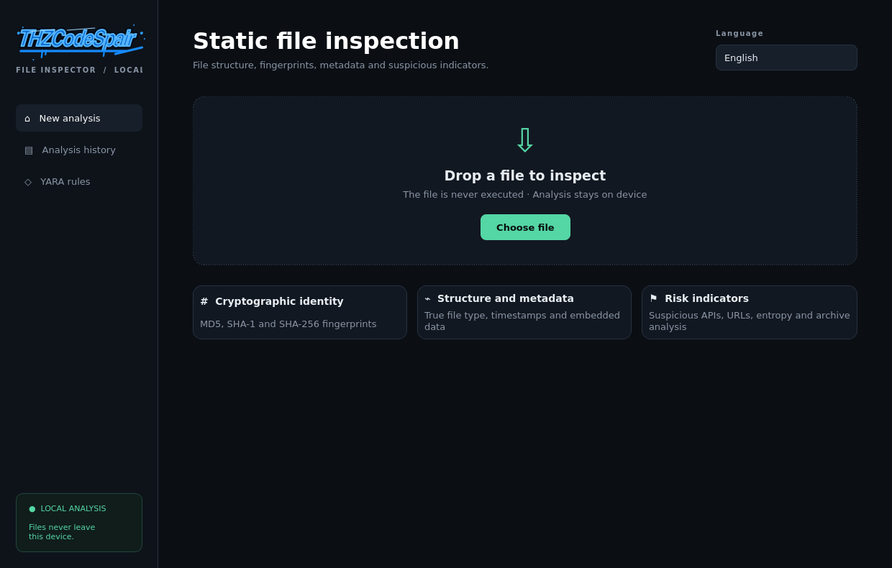

# THZCodeSpair File Inspector

<div align="center">

[](README.md)
[](README_EN.md)

</div>


A local-first desktop application and CLI for inspecting suspicious files **without executing or uploading them**.



## What makes it useful?

File Inspector goes beyond a binary antivirus verdict by explaining *why* a risk score was assigned. It combines fingerprints, true file format, metadata, entropy, embedded network indicators, PE/ELF security properties, archive structure and YARA matches in one auditable report.

## Features

- Fully local inspection with no automatic cloud submission
- MD5, SHA-1 and SHA-256 fingerprints
- Content-based file identification through libmagic
- PE imports/APIs, signature table, section entropy and overlay inspection
- ELF executable-stack and RELRO checks
- PDF JavaScript, OpenAction, Launch and EmbeddedFile detection
- Office VBA macro, encrypted archive and ZIP path-traversal detection
- URL, IP address, e-mail and printable string extraction
- Bundled YARA rules for process injection, credential access, ransomware, script obfuscation and Android abuse
- Automatic ClamAV signature scan when available
- Explainable 0–100 risk score
- Local SQLite analysis history
- Standalone HTML and machine-readable JSON reports
- Turkish and English desktop interface
- Automation-friendly CLI with configurable failure thresholds

## Quick start

```bash
git clone https://github.com/batuthzcode/batuthzcode-file-inspector.git
cd batuthzcode-file-inspector
python3 -m venv .venv
source .venv/bin/activate
pip install -e .
python main.py
```

Recommended Linux packages:

```bash
sudo apt install libmagic1 exiftool binutils
# Optional local antivirus signatures:
sudo apt install clamav && sudo freshclam
```

## CLI

```bash
# Human-readable terminal summary
thz-inspect suspicious.exe

# Standalone HTML and structured JSON reports
thz-inspect suspicious.exe --html report.html --json report.json

# Return exit code 2 when a high-risk file is found
thz-inspect artifact.bin --quiet --fail-on high
```

Exit codes: `0` successful analysis, `1` analysis error, `2` configured risk threshold exceeded.

## Risk model

The score is not based on a single signature. Weighted structural findings and behavioral indicators are combined:

| Range | Verdict | Meaning |
|---:|---|---|
| 0–14 | Low risk | No clear static indicator was found |
| 15–39 | Caution | Indicators require manual review |
| 40–69 | Suspicious | Several strong indicators were found |
| 70–100 | High risk | A strong signature or behavioral chain is present |

> A low-risk result is not a guarantee of safety. Static analysis cannot observe encrypted, downloaded-at-runtime or environment-dependent behavior.

## Security design

- The target file is never imported, loaded or executed.
- File-controlled text is never passed through a shell.
- External parsers use argument lists and timeouts.
- Archives are listed without extracting their contents.
- All file-derived content is escaped in HTML reports.
- No automatic VirusTotal or cloud submission exists.

Read [SECURITY.md](SECURITY.md) and the [architecture document](docs/ARCHITECTURE.md) for details.

## Development

```bash
pip install -e ".[dev]"
pytest
./scripts/build_linux.sh
```

## Project status

The project is under active development. Planned work includes APK manifest parsing, Authenticode certificate-chain validation, user-managed YARA directories and an isolated dynamic-analysis adapter.

## License

[MIT](LICENSE) © THZCodeSpair
